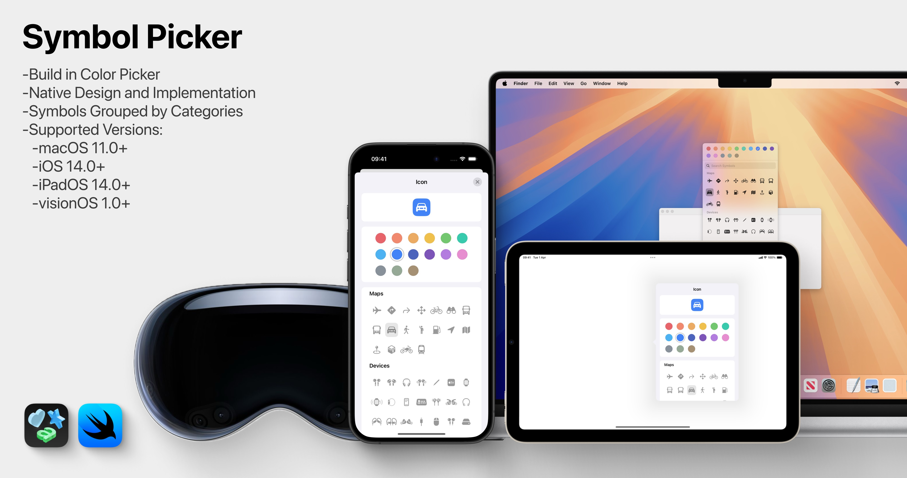

# `SymbolPicker`




A native Apple component for browsing and selecting SF Symbols with style and color customization.

## Overview

SymbolPicker provides an elegant, native-feeling symbol picker for Apple platforms. Built to seamlessly integrate with SwiftUI, this package makes it easy to incorporate Apple's SF Symbols into your application with a familiar interface that users will immediately understand.

The package offers two primary ways to implement symbol picking:
- The `SymbolPicker` view component for custom UI implementations
- The `.symbolPicker` view modifier for quick, out-of-the-box implementation with three flexible color binding options

## Features

- Native Apple-like design and behavior
- Support for all available SF Symbols
- Symbol categorization matching Apple's organization
- Dynamic search functionality
- Customizable symbol rendering styles
- Multiple color selection options (RGB values, SwiftUI Color, or predefined SymbolColor)
- Option to use filled or outline symbol variants
- Full support for all dynamic type font sizes
- Dark and light mode compatibility
- Cross-platform support:
  - iOS 14+
  - iPadOS 14+
  - macOS 11+
  - visionOS 1.0+

## Symbol Picker Component

The core component of the package is the `SymbolPicker` view which can be embedded directly in your SwiftUI layout:

```swift
SymbolPicker(
    symbolName: Binding<String>,
    color: Binding<[Double]>,
    useFilledSymbols: Bool = true,
    dismissOnSymbolChange: Bool = false
)
```

You can also use SymbolPicker without color selection:

```swift
SymbolPicker(
    symbolName: Binding<String>,
    useFilledSymbols: Bool = true,
    dismissOnSymbolChange: Bool = false
)
```

> **Note:** When `dismissOnSymbolChange` is set to `true`, the popover will automatically dismiss when a symbol is selected.
>
> **Note:** The `useFilledSymbols` parameter determines which variant of symbols is displayed. When set to `true` (default), filled variants like "star.fill" are preferred. When set to `false`, outline variants like "star" are used.

## Symbol Picker Modifiers

The package provides three flexible modifier options to accommodate different color binding preferences:

### Using RGB Values

```swift
.symbolPicker(
    isPresented: Binding<Bool>,
    symbolName: Binding<String>,
    color: Binding<[Double]>,
    useFilledSymbols: Bool = true,
    dismissOnSymbolChange: Bool = false
)
```

or

### Using SwiftUI Color

```swift
.symbolPicker(
    isPresented: Binding<Bool>,
    symbolName: Binding<String>,
    color: Binding<Color>,
    useFilledSymbols: Bool = true,
    dismissOnSymbolChange: Bool = false
)
```

### Using Predefined SymbolColor

```swift
.symbolPicker(
    isPresented: Binding<Bool>,
    symbolName: Binding<String>,
    color: Binding<SymbolColor>,
    useFilledSymbols: Bool = true,
    dismissOnSymbolChange: Bool = false
)
```

### Without Color Selection

```swift
.symbolPicker(
    isPresented: Binding<Bool>,
    symbolName: Binding<String>,
    useFilledSymbols: Bool = true,
    dismissOnSymbolChange: Bool = false
)
```

> **Note:** When running on macOS 11, the `isPresented` parameter is required for all symbolPicker implementations.

## SymbolColor Options

The package includes a comprehensive set of predefined colors matching Apple's standard color palette:

- `.red`
- `.orange`
- `.yellow`
- `.green`
- `.mint`
- `.teal`
- `.cyan`
- `.blue`
- `.indigo`
- `.purple`
- `.magenta`
- `.pink`
- `.grey`
- `.moro`
- `.brown`
- `.custom([Double])` - Allows precise custom RGB color values from the in-app color picker

### Using the Custom Color Option

The `.custom([Double])` option provides full flexibility when working with the built-in color picker:

```swift
// Array represents RGBA values (red, green, blue, alpha)
// Each value ranges from 0.0 to 1.0
let customRGBA: [Double] = [0.75, 0.32, 0.88, 1.0] // Purple with full opacity
let symbolColor: SymbolColor = .custom(customRGBA)
```

This option is particularly useful when:
- Implementing specific brand colors
- Storing and retrieving user-selected custom colors

## Example

Here's a complete example showing how to implement a symbol picker in your app:

```swift
import SwiftUI
import SymbolPicker

struct ContentView: View {
    @State private var selectedSymbol: String = "car.fill"
    @State private var colorValues = [0.906, 0.392, 0.416, 1]
    @State private var isPickerPresented: Bool = false
    
    var body: some View {
        VStack(spacing: 20) {
            // Display the currently selected symbol
            Image(systemName: selectedSymbol)
                .foregroundStyle(Color(
                    red: colorValues[0],
                    green: colorValues[1],
                    blue: colorValues[2]
                ))
                .font(.system(size: 64))
            
            Text("Current symbol: \(selectedSymbol)")
                .font(.headline)
            
            // Button to show the picker
            Button("Change Symbol") {
                isPickerPresented.toggle()
            }
            .popover(isPresented: $isPickerPresented) {
                SymbolPicker(
                    symbolName: $selectedSymbol,
                    color: $colorValues,
                    useFilledSymbols: true
                )
            }
        }
        .padding()
        .frame(width: 300, height: 200)
    }
}
```

### Example Using Predefined Colors and Outline Variants

```swift
import SwiftUI
import SymbolPicker

struct ContentView: View {
    @State private var selectedSymbol: String = "car"
    @State private var symbolColor: SymbolColor = .blue
    @State private var isPickerPresented: Bool = false
    
    var body: some View {
        VStack {
            Image(systemName: selectedSymbol)
                .font(.system(size: 64))
                .padding()
            
            Button("Select Symbol") {
                isPickerPresented.toggle()
            }
        }
        .symbolPicker(
            isPresented: $isPickerPresented,
            symbolName: $selectedSymbol,
            color: $symbolColor,
            useFilledSymbols: false
        )
    }
}
```

### Example Using Custom Color

```swift
import SwiftUI
import SymbolPicker

struct ContentView: View {
    @State private var selectedSymbol: String = "star.fill"
    @State private var symbolColor: SymbolColor = .custom([0.85, 0.21, 0.45, 1.0])
    @State private var isPickerPresented: Bool = false
    
    var body: some View {
        VStack {
            Image(systemName: selectedSymbol)
                .foregroundColor(symbolColor.color)
                .font(.system(size: 64))
                .padding()
            
            Text("Symbol: \(selectedSymbol)")
                .font(.subheadline)
            
            Button("Select Symbol") {
                isPickerPresented.toggle()
            }
        }
        .symbolPicker(
            isPresented: $isPickerPresented,
            symbolName: $selectedSymbol,
            color: $symbolColor,
            useFilledSymbols: true
        )
    }
}
```

### Example Without Color Selection

```swift
import SwiftUI
import SymbolPicker

struct ContentView: View {
    @State private var selectedSymbol: String = "star.fill"
    @State private var isPickerPresented: Bool = false
    
    var body: some View {
        VStack {
            Image(systemName: selectedSymbol)
                .font(.system(size: 64))
                .symbolRenderingMode(.monochrome)
                .padding()
            
            Text("Symbol: \(selectedSymbol)")
                .font(.subheadline)
            
            Button("Select Symbol") {
                isPickerPresented.toggle()
            }
        }
        .symbolPicker(
            isPresented: $isPickerPresented,
            symbolName: $selectedSymbol,
            useFilledSymbols: true,
            dismissOnSymbolChange: true
        )
    }
}
```

## iOS, iPadOS, and visionOS Implementation Notes

The `.symbolPicker` view modifier automatically handles the appropriate presentation style based on the platform:

- On iPhone (iOS), it uses sheets
- On iPad (iPadOS), it uses popovers
- On Vision Pro (visionOS), it uses popovers

This means you don't need to manually implement different presentation methods for each platform. Simply use the `.symbolPicker` modifier and it will adapt appropriately:

```swift
import SwiftUI
import SymbolPicker

struct MobileContentView: View {
    @State private var selectedSymbol: String = "star.fill"
    @State private var symbolColor: SymbolColor = .blue
    @State private var isPickerPresented: Bool = false
    
    var body: some View {
        NavigationView {
            VStack {
                Image(systemName: selectedSymbol)
                    .foregroundColor(symbolColor.color)
                    .font(.system(size: 80))
                    .padding()
                
                Text("Current symbol: \(selectedSymbol)")
                    .font(.headline)
                
                Button("Select Symbol") {
                    isPickerPresented.toggle()
                }
                .padding()
            }
            .navigationTitle("Symbol Picker Demo")
            // The symbolPicker modifier automatically handles the correct 
            // presentation style for each platform (sheet on iPhone, popover on iPad)
            .symbolPicker(
                isPresented: $isPickerPresented,
                symbolName: $selectedSymbol,
                color: $symbolColor,
                useFilledSymbols: true
            )
        }
    }
}
```

## Accessibility Features

SymbolPicker is designed with accessibility in mind, providing a seamless experience for all users:

- **Dynamic Type Support**: The interface fully adapts to all dynamic type font sizes, ensuring readability for users with visual impairments
- **Readable Layout**: All text and symbols adjust appropriately to the user's preferred font size settings
- **Consistent with System Behaviors**: Follows the same accessibility patterns as native Apple components

## Integration with Other Frameworks

SymbolPicker is designed to work seamlessly with other SwiftUI components and can be easily integrated into various UI patterns:

- Use with `NavigationView` for hierarchical navigation
- Embed in `Form` for settings interfaces
- Incorporate into `List` for selection interfaces
- Use with `TabView` for multi-pane interfaces

## Installation

### Swift Package Manager

Add the following to your `Package.swift` file:

```swift
dependencies: [
    .package(url: "https://github.com/SzpakKamil/SymbolPicker.git", from: "0.6.0")
]
```

Or add it directly via Xcode:
1. File > Swift Packages > Add Package Dependency
2. Enter package URL: `https://github.com/SzpakKamil/SymbolPicker.git`
3. Select the version you want to use

## Requirements

- iOS 14.0+
- iPadOS 14.0+
- visionOS 1.0+
- macOS 11.0+
- Swift 5.4+
- Xcode 12.5+

## License

SymbolPicker is available under the MIT license.
